# 💻 Web Development Projects

This repository contains **four web development projects** created as part of my learning journey.  
Each project is built using **HTML, CSS, JavaScript (and Firebase where required)**.  
Below are details of each project along with screenshots.

---

## 📸 Projects Overview

### 1. 🖼️ Image Slider
**Technologies:** HTML, CSS, JavaScript  

**Description:**  
An interactive image slider (carousel) that allows users to view multiple images with smooth transitions.  
It supports manual navigation (next/prev buttons) and automatic slideshow functionality.

**Features:**
- Responsive design  
- Smooth transitions  
- Auto-slide option  

**Screenshot:**  
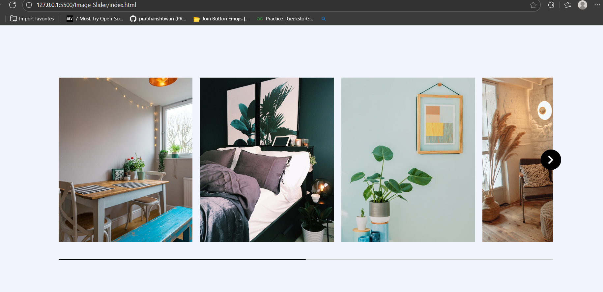

---

### 2. 💬 SparkTalks Chat Application
**Technologies:** HTML, CSS, JavaScript,Firebase

**Description:**  
A real-time chat application where users can join rooms, send messages, and interact instantly.  
The app features authentication, room creation, and live chat updates.

**Features:**
- Real-time messaging with WebSockets  
- Create & join chat rooms  
- User authentication with unique usernames  
- Timestamps & message formatting  

**Screenshots:**  
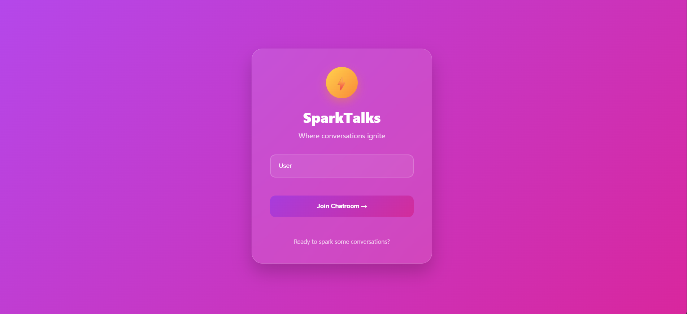  
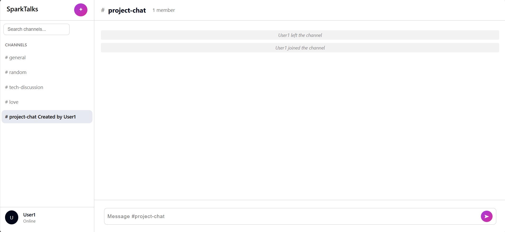  
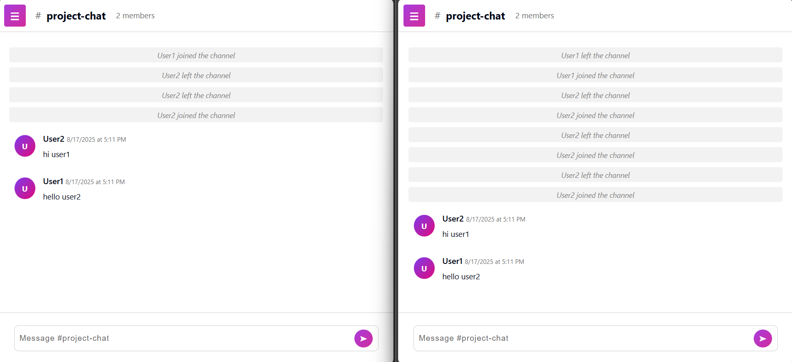

---

### 3. 🏋️ Gym Management System
**Technologies:** HTML, CSS, JavaScript, React, Firebase

**Description:**  
A system to manage gym operations including member registration, billing, fee packages, and diet details.  
It allows both **admins** and **members** to manage their fitness journey.

**Features:**
- Admin login & management  
- Add, update, delete members  
- Billing & fee package assignment  
- Supplement & diet details  
- Notifications and reports  

**Screenshot:**  
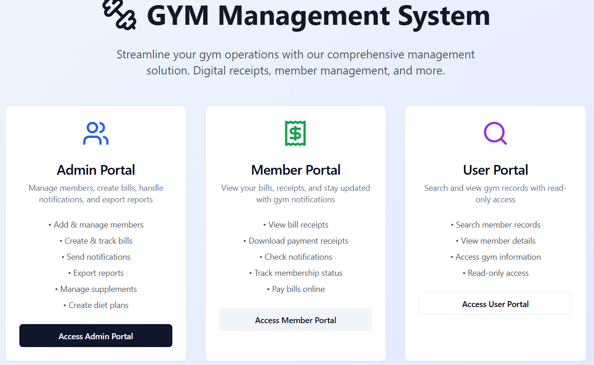
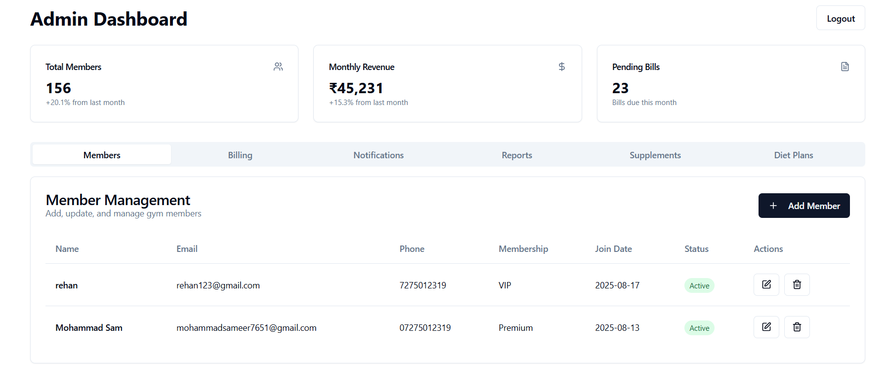
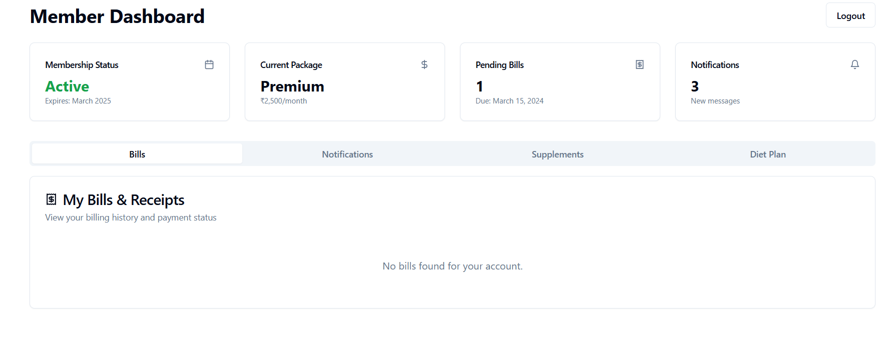
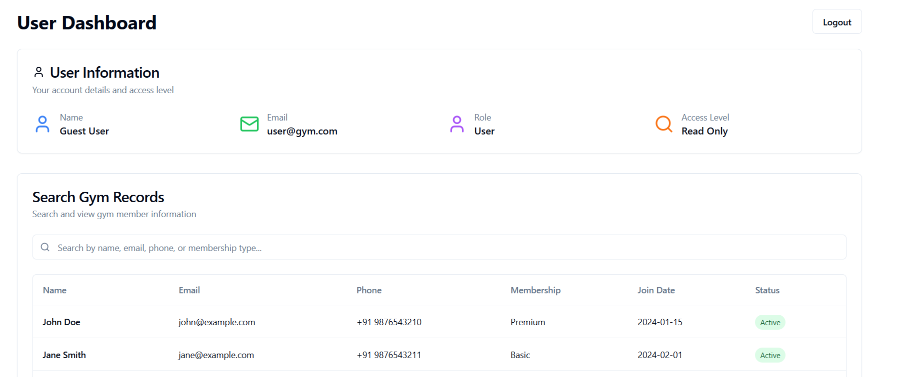

---

### 4. 🎓 Career Guidance System
**Technologies:** HTML, CSS, JavaScript, React, Firebase

**Description:**  
A career guidance system to assist students in finding the best college and course (India & Abroad).  
Includes aptitude tests, eligibility checks, and detailed college lists.

**Features:**
- Admin-controlled system  
- Student login & registration  
- College list with filters  
- Aptitude test & score generation  
- Location-based search (India / Abroad)  

**Screenshots:**  
  
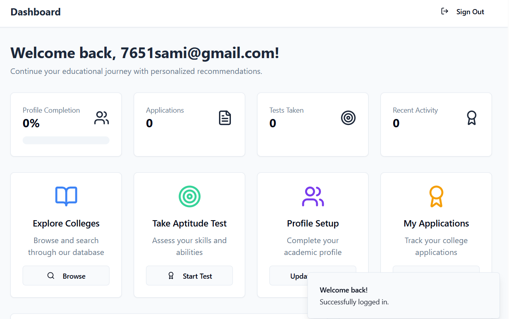  
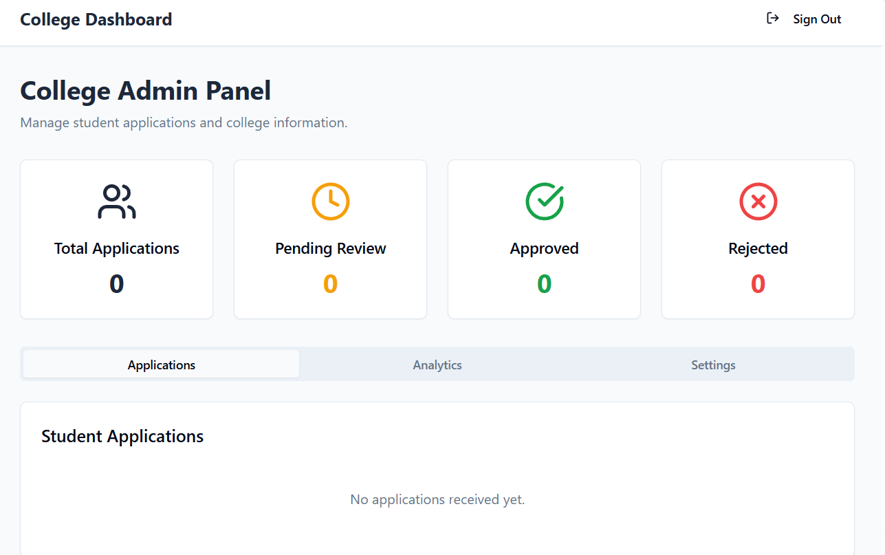
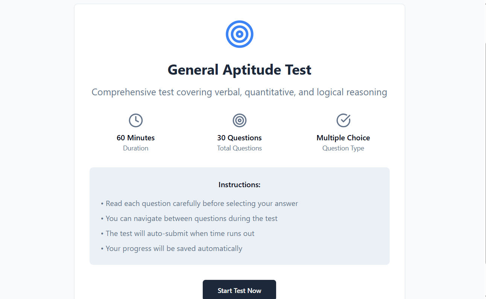

---

---

## 🙌 Author
**Mohammad Sameer**  
BCA (2026) | Frontend & Python Developer  

---
